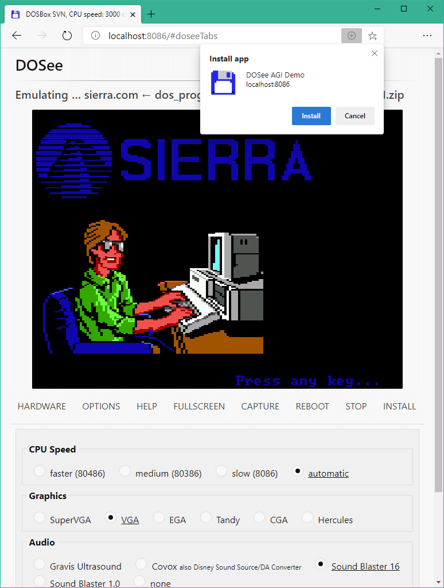

# DOSee


&nbsp;


&nbsp;


#### [If you enjoy DOSee, consider buying me a cup of coffee?](https://www.buymeacoffee.com/4rtEGvUIY)

## An MS-DOS emulator for the web.

DOSee is a front-end for an [MS-DOS](https://en.wikipedia.org/wiki/MS-DOS) emulation ecosystem to use on the web.

The text-based MS-DOS was the dominant personal computer platform for much of the 1980s up until the mid-1990s before being superseded by Microsoft Windows. Emulating this platform allows the running of tens of thousands of games, demos and applications from this era to run on a web browser both online or offline as a desktop web-app!

**[Try it online at dosee.link](https://dosee.link)**

DOSee is an interface and installation process for an incredible emulation ecosystem created by many amazing people over the years.

The application itself is a fork of [The Emularity](https://github.com/db48x/emularity) project created by the Internet Archive. [EM-DOSBox](https://github.com/dreamlayers/em-dosbox/), the core of this emulation, is a JavaScript port of [DOSBox](https://www.dosbox.com), the world's most popular MS-DOS emulator.



### What's new

[Changes and updates are in CHANGES.md](CHANGES.md).

### Requirements

- A web browser that supports JavaScript ES6 (ECMAScript 2015),
  current Firefox, Chrome, Edge or Safari are good.
- A physical keyboard, as MS-DOS is a text-based operating system.
- [Node.js](https://nodejs.org), with [yarn](https://yarnpkg.com/) or [npm](https://www.npmjs.com/get-npm) and [npx](https://www.npmjs.com/package/npx).

_DOSee requires an HTTP server, it can not run using the `file:///` browser protocol._

### Instructions, **download and build**

DOSee requires building before it is ready to serve to a web browser.

#### Clone DOSee.

```bash
git clone https://github.com/bengarrett/DOSee.git
```

#### Install the dependencies and build DOSee.

`npm` is the included package manager for node.js that [is available for all major platforms](https://nodejs.org/en/download/). `yarn` [is an alternative](https://yarnpkg.com/), easier package manager for node.js.

```bash
cd DOSee
yarn # npm install
```

#### Future updates.

Any updates to the files in `src/` require an install command to apply the changes.

```bash
yarn run install # npm run install
```

### Serve, **yarn**

Serve the `build` directory over port _8086_.

```bash
yarn run serve # npm run serve
```

Point a web browser to http://localhost:8086

### Serve, **Docker Compose**

Run the DOSee container.

```bash
docker-compose up
```

Point a web browser to http://localhost:8086

### Serve, **Docker**

Build DOSee using the included Dockerfile.

```bash
docker build -t dosee .
```

Run the DOSee image as a container.

```bash
docker run --name dosee_app -i -p 8086:80 dosee
```

Point a web browser to http://localhost:8086

```bash
docker stop dosee_app # to stop the container
```

### Usage, hosting and troubleshooting.

[Can be found in USAGE.md](USAGE.md).

### Licenses

1. DOSee is under GPL-3.0.
2. Em-DOSBox located in `src/emulator` is under GPL-2.0.
3. `src/disk_drives` and `src/dos_programs` contain non-free software binaries that are there for convenience.

### Similar projects

- [js-dos](https://github.com/caiiiycuk/js-dos) - _The best API for running dos programs in the browser._
