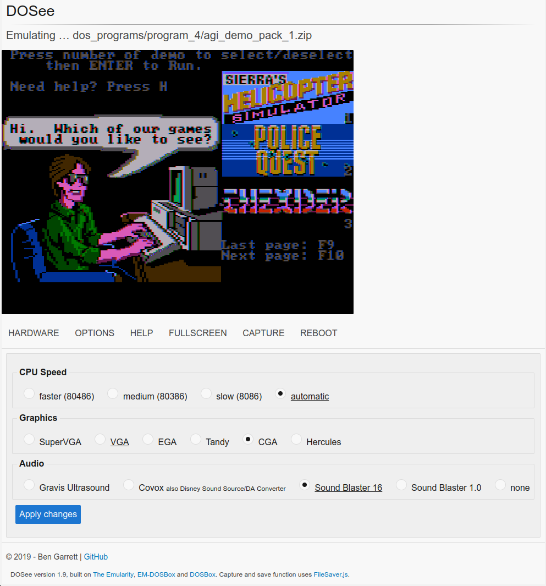

# DOSee

## An MS-DOS emulator for the web.

DOSee is a front-end for an [MS-DOS](https://en.wikipedia.org/wiki/MS-DOS) emulation ecosystem to use on the web. The text-based MS-DOS was the dominant personal computer platform for much of the 1980s up until the mid-1990s before being superseded by Microsoft Windows. Emulating this platform allows the running of tens of thousands of games, demos and applications from this era to run on a web browser!

DOSee is only a user interface and installation process for an incredible emulation ecosystem created by many amazing people over many years. DOSee itself is a fork of [The Emularity](https://github.com/db48x/emularity) project created by the Internet Archive. [EM-DOSBox](https://github.com/dreamlayers/em-dosbox/) the core of this emulation is a JavaScript port of [DOSBox](https://www.dosbox.com), the world's most popular MS-DOS emulator.



### What's new

[Changes and updates can be found in CHANGES.md](CHANGES.md)

### Requirements

- A web browser that supports JavaScript ES6 (ECMAScript 2015).
  Current Firefox, Chrome, Edge or Safari will work fine.
- A physical keyboard, as MS-DOS is a text-based operating system.
- [npm](https://www.npmjs.com/get-npm) or a [Docker](https://www.docker.com/products/docker-desktop) installation with `docker-compose`, instructions are below.

_DOSee has to be served over a HTTP server, it can not be run using the browser `file:///` protocol._

### Instructions, **npm**

npm is the package manager for node.js and is included in that environment. [It's available for all major platforms](https://nodejs.org/en/download/).

Clone DOSee.

```
git clone https://github.com/bengarrett/DOSee.git
```

Install dependencies.

```
cd DOSee
npm install --only=prod
```

Run a local web server.

```
http-server -p 5550
```

Point a web browser to http://localhost:5550

### Instructions, **Docker**

Requirements:

- Docker engine: 17.04.0+
- docker-compose: 3.2

Clone DOSee.

```
git clone https://github.com/bengarrett/DOSee.git
```

Build and run the DOSee container.

```
docker-compose up -d
```

Point a web browser to http://localhost:5550

To shutdown the DOSee container.

```
docker-compose down
```

### Usage & customisations

[Can be found in USAGE.md](USAGE.md)

### License

1. DOsee is released under GPL-3.0.
2. Em-DOSBox located in `/emulator` is released under GPL-2.0.
3. `/disk_drives` and `/dos_programs` contain non-free software binaries that are included for convenience.
