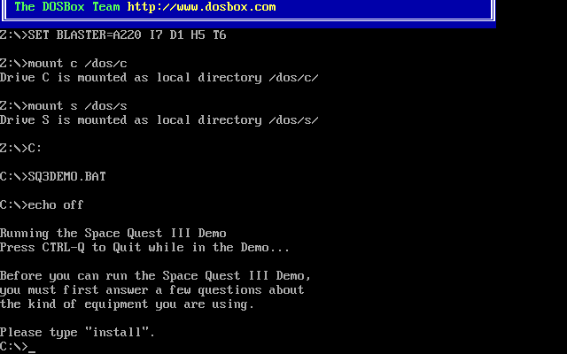

# DOSee

## Your updates

Any changes to the files or assets in [`src/`](src/) require an install command for the updates to apply.

```bash
yarn run install # npm run install
```

> #### Chrome's service worker cache may also need reconfiguring.
>
> In an active DOSee browser tab, press `Ctrl` `Shift` `I` and select the **Application** tab; under **Service Workers** enable the **Update on Refresh** checkbox.

## Usage & customisations

It is easy to customise DOSee to load other MS-DOS programs by using HTML5 `<meta>` elements. An [src/index.html](src/index.html) file is an identifier which contains six meta elements used by DOSee for handling emulation information and customisation.

```html
<!-- DOSee initialisation options -->
<meta
  name="dosee:zip:path"
  content="dos_programs/program_4/agi_demo_pack_1.zip"
/>
<meta name="dosee:run:filename" content="sierra.com" />

<meta name="dosee:capture:filename" content="screenshot.png" />
<meta name="dosee:utilities" content="false" />
<meta name="dosee:audio:gus" content="false" />
<meta name="dosee:width:height" content="640, 400" />
```

### Required elements

#### `<meta name="dosee:zip:path">`

DOSee uses ZIP file archives to simulate a hard disk drive. Any ZIP file provided to the _dosee:zip:path_ is the emulator mount path to MS-DOS drive `C:`. The `C:` drive will be accessible to all DOS commands such as `dir C:` and any included DOS programs available to run.

The meta _content_ attribute must be a relative path from the webroot and needs to point to a ZIP file archive.

✓ `<meta name="dosee:zip:path" content="dos_programs/example/dosgame.zip" />`

✗ `<meta name="dosee:zip:path" content="/home/me/DOSee/dos_programs/example/dosgame.zip" />`

#### `<meta name="dosee:run:filename">`

The filename of the MS-DOS program DOSee should launch. The program file needs to exist in the ZIP archive provided to _dosee:zip:path_.

DOS usually uses the following file extensions to identify a program: `.exe` `.com` `.bat`. Other than these, there is no standard file naming convention to identify which file should launch a piece of DOS software.

If the content is left blank or the filename doesn't exist in the archive, DOSee launches into a DOS `C:` prompt.

✓ `<meta name="dosee:run:filename" content="game.exe" />`

### Optional elements

#### `<meta name="dosee:capture:filename">`

Capture filename is used by the screenshot tool to save emulator screenshots. The PNG images should include the `.png` file extension.

✓ `<meta name="dosee:capture:filename" content="game.png" />`

✗ `<meta name="dosee:capture:filename" content="game" />`

#### `<meta name="dosee:utilities">`

When set to `true`, it tells DOSee to mount a collection of MS-DOS utilities and tools that are accessible from the `U:` drive. The default option is false.

✓ `<meta name="dosee:utilities" content="true" />`

✓ `<meta name="dosee:utilities" content="false" />`

#### `<meta name="dosee:width:height">`

Width and height configure the initial pixel size of the emulation loading screen and canvas. The canvas may readjust itself after the emulator runs depending on the graphics hardware selection, scale options and aspect correction settings. The default canvas and screen size is 640px x 480px.

✓ `<meta name="dosee:width:height" content="640,400" />`

✗ `<meta name="dosee:width:height" content="640px, 400px" />`

### Placeholder elements

#### `<meta name="dosee:audio:gus">`

When set to `true`, it tells DOSee to mount a collection of Gravis Ultrasound audio drivers and tools that are accessible from the `G:` drive. These drivers are always loaded by DOSee whenever the Gravis Ultrasound audio option is selected so this should always be `false`.

### Sample programs

There are three additional sample programs included in this repository that you can try out. In the [index.html](index.html) update the following `<meta>` elements.

```html
<!-- DOSee initialisation options -->
<meta
  name="dosee:zip:path"
  content="dos_programs/program_4/agi_demo_pack_1.zip"
/>
<meta name="dosee:run:filename" content="sierra.com" />
```

#### Sample program 1 (fastest, VGA, Gravis Ultrasound)

```html
<meta name="dosee:zip:path" content="dos_programs/program_1/df2intro.zip" />
<meta name="dosee:run:filename" content="DF2.EXE" />
```

#### Sample program 2 (fastest, VGA, Gravis Ultrasound)

```html
<meta name="dosee:zip:path" content="dos_programs/program_2/df2.zip" />
<meta name="dosee:run:filename" content="df2.exe" />
```

#### Sample program 3 (fastest, VGA, Sound Blaster 16)

```html
<meta name="dosee:zip:path" content="dos_programs/program_3/hyb605.zip" />
<meta name="dosee:run:filename" content="hyb605.exe" />
```

### Add new software example

Create a new program subdirectory. For your implementation, there is no requirement to follow this `dos_programs/` directory naming structure.

```
cd DOSee
mkdir -p dos_programs/program_5
```

Download the [Space Quest 3 non-interactive demo](https://www.scummvm.org/frs/demos/sci/sq3-dos-ni-demo-en.zip) and save it to the new program subdirectory.

```
wget -O dos_programs/program_5/sq3-demo.zip https://www.scummvm.org/frs/demos/sci/sq3-dos-ni-demo-en.zip
```

Update the DOSee [index.html](index.html) to launch the demo and enjoy the confusing mess that is the MS-DOS era of computer games.

```html
<!-- DOSee initialisation options -->
<meta name="dosee:zip:path" content="dos_programs/program_5/sq3-demo.zip" />
<meta name="dosee:run:filename" content="SQ3DEMO.BAT" />
```



## Hosting

Since DOSee usages several modern web technologies that complicate the hosting of the app, the configuration isn't as apparent as you might assume.
Being a [Progressive Web Application](https://developer.mozilla.org/en-US/docs/Web/Progressive_web_apps) requires serving over an HTTPS connection.
While HTTPS serving on modern browsers also demand the use of a complicated [Content Security Policy](https://developer.mozilla.org/en-US/docs/Web/HTTP/CSP).
Below is an example nginx configuration to serve DOSee [over a proxy](https://docs.nginx.com/nginx/admin-guide/web-server/reverse-proxy/). It assumes DOSee is also running on the same host listening on port 8086.

A few things to note.

- All `server_name`, `ssl_certificate` and `ssl_certificate_key` selections which contain `dosee.site` get swapped with your own domain name.
- The `Content-Security-Policy` header must not have any newlines.
- The `location` selections need `[[HOST IP ADDRESS]]` replaced with the host server's IP address.

> `/etc/nginx/conf.d/dosee.conf`

```nginx
##
# DOSee proxy example on nginx
#
server {
    listen 80;
    server_name www.dosee.site dosee.site;
    server_tokens off;
    location / {
        return 301 https://$host$request_uri;
    }
}
server {
    listen 443 ssl http2;
    server_name www.dosee.site dosee.site;
    server_tokens off;
    add_header Content-Security-Policy
        "default-src 'self';img-src 'self' data:;frame-ancestors 'none';font-src 'self' data:;script-src 'self' 'unsafe-eval' data:;script-src-elem 'self' https://storage.googleapis.com/workbox-cdn/ data:";
    # 0, one day: 86400, two years: 63072000:
    add_header Cache-Control "public, max-age=86400";
    add_header X-Frame-Options "DENY";
    add_header X-Content-Type-Options "nosniff";
    add_header Strict-Transport-Security
        "max-age=63072000; includeSubDomains"
        always;
    ssl_certificate /etc/letsencrypt/live/dosee.site/fullchain.pem;
    ssl_certificate_key /etc/letsencrypt/live/dosee.site/privkey.pem;
    location ~ .(css|js)$ {
        proxy_pass http://[[HOST IP ADDRESS]]:8086;
    }
    location / {
        proxy_pass http://[[HOST IP ADDRESS]]:8086;
    }
}
```

[back to README.md](README.md)
