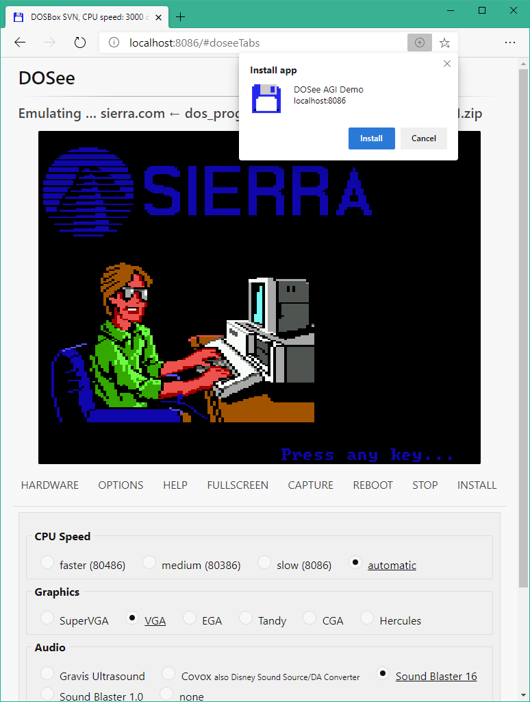

# DOSee


&nbsp;


&nbsp;


#### [If you enjoy DOSee, consider buying me a cup of coffee?](https://www.buymeacoffee.com/4rtEGvUIY)

## An MS-DOS emulator for the web.

DOSee is a front-end for an [MS-DOS](https://en.wikipedia.org/wiki/MS-DOS) emulation ecosystem for the web. MS-DOS was the dominant personal computer platform from the 1980s until the mid-1990s, when it was superseded by Microsoft Windows. Emulating this platform allows tens of thousands of games, demos, and applications from this era to run in a web browser, both online and offline as a desktop web app.

DOSee provides only the user interface and installation process for an incredible emulation ecosystem. Many remarkable people have contributed to this ecosystem over many years. DOSee itself is a fork of [The Emularity](https://github.com/db48x/emularity) project started by the Internet Archive. [EM-DOSBox](https://github.com/dreamlayers/em-dosbox/), the core of this emulation, is a JavaScript port of [DOSBox](https://www.dosbox.com), the world's most popular MS-DOS emulator.

---



### What's new

[Updates are in CHANGES](CHANGES.md)

### Requirements

- A web browser that supports service workers.<br>
  Current Chrome, Edge, Safari, or Firefox will work fine.
- A physical keyboard, as MS-DOS is a text-based operating system.
- [Node.js](https://nodejs.org) or [Docker](https://www.docker.com/get-started)

**DOSee runs over an HTTP server**, and it can not function over the `file:///` browser protocol.

## Instructions, _download, build and serve_

DOSee requires a build before it can serve to a web browser.

```bash
# clone DOSee
git clone git@github.com:bengarrett/DOSee.git
cd DOSee

# install dependencies & build
pnpm install

# serve DOSee over port 8086
pnpm run serve
```

Point a web browser to http://localhost:8086

[Usage instructions](USAGE.md) provide detailed configuration options.

## Editing the source JS or HTML

> **Note:** DOSee is considered feature complete. For new features, consider forking the project.

If you edit the source files in `src/` you will need to rebuild the application.

```bash
# change to the repo directory
cd DOSee

# re-build DOSee using your edits
pnpm run install

# serve the modified DOSee over port 8086
pnpm run serve
```

Point a web browser to http://localhost:8086

Due to the PWA offline feature, web browsers need to unregister the service workers to reflect any changes to the application code. There is a red _Update DOSee and the service worker_ button on the index.html example that will do this and then reload the browser window. The eventListener code for this button can be found in the `src/js/dosee-sw.js` file.

## Gamepad support

DOSee has hacked support for Xbox and PlayStation gamepad controllers, which act as keyboard input for DOS games. When enabled,
gamepad buttons map to keyboard controls (D-pad for arrow keys, face buttons for common actions like Space, Enter, Escape). To customize or modify the button mappings, edit the `export const gamepadConfigs = {}` object in `src/js/dosee-gamepad.js`.

### License

1. DOSee is under a GPL-3.0 license.
2. Em-DOSBox located in `src/emulator` is under GPL-2.0 license.
3. `src/disk_drives` and `src/dos_programs` contain non-free software binaries for your convenience.

### Similar projects

- [js-dos](https://github.com/caiiiycuk/js-dos) _The best API for running dos programs in a browser_
